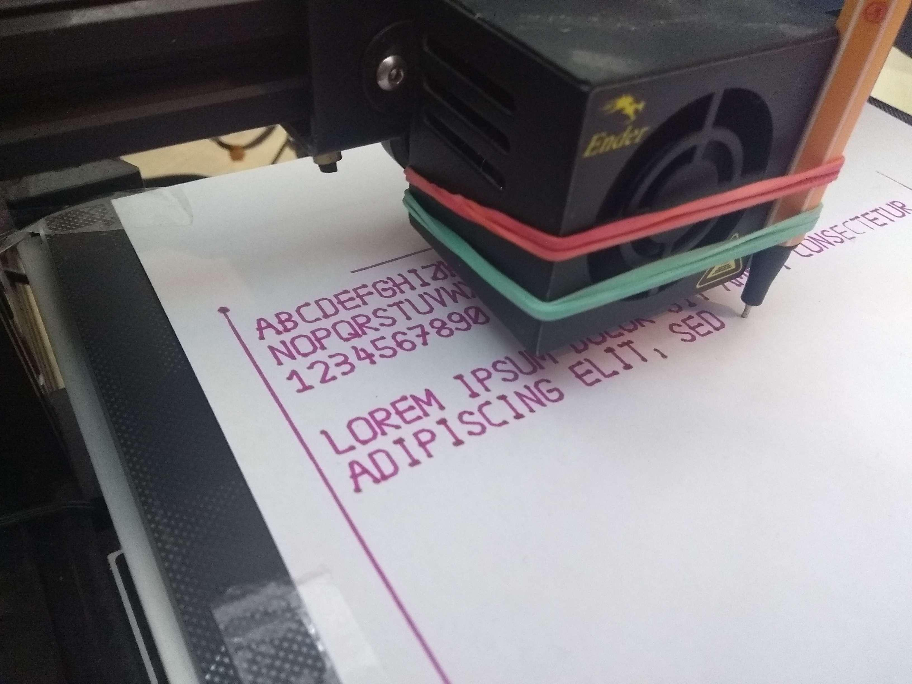

# GCode Plotter
##### AKA the 2D Printer, evolution of the 3D Printer

Code tool paths to plot a sketch on your 3d printer using a marker/pen.

Examples can be found in [testing](../testing) directory.

Although this directory includes precompiled gcode files, recompiling them is advised as they might not be up to date.

## How to use:
##### Requirements:
- need python 3.10 installed and on path
- rust to compile
- a machine that can run gcode or a [tool path viewer](https://ncviewer.com/) to run/test

##### Making the sketch
- Start the interactive preview to see how your current program will look like. 
- The preview wil auto update every time there is a change to your file.

##### Plotting the sketch
- Once you are satisfied with your result, run the compiler.
- Put a piece of paper onto your printer and secure it.
- Now start your printer with the gcode file.
- The printer should auto-home, then pause. 
- Now attach the pen so that it almost touches the paper, and press `resume`. 
Note: test how far down you need to put the pen so that it reaches the paper, but does not press into it
too long as that might create sploches of ink. Make sure the pen is secured in a way that if flexes back 
down if pressed up slightly (see image above)
- Do not lose the cap of the marker as I did.

##### Run the _gcode compiler_:
`cargo run -- compile <instructions.py> <out.gcode>`

##### Run the _interactive preview_:
`cargo run -- repl <instructions.py>`

